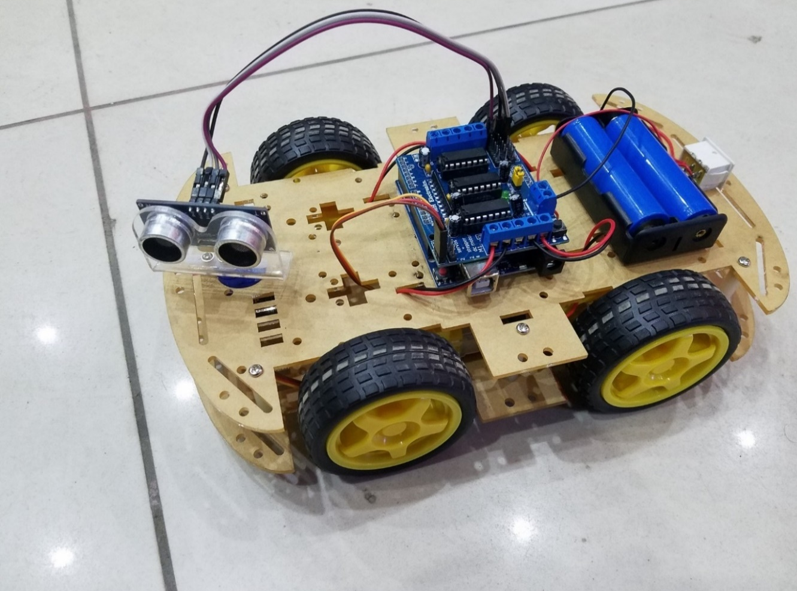

# 🚗 Obstacle Avoiding Car Using Arduino UNO

An autonomous robot that detects obstacles using an ultrasonic sensor and changes its path automatically. Developed using **Arduino UNO**, **HC-SR04 Ultrasonic Sensor**, **Servo Motor**, and **L293D Motor Driver**.

---

## 📌 Features

- Automatic obstacle detection
- Autonomous navigation
- Servo-based scanning
- Ultrasonic distance measurement
- Arduino UNO based
- Easy to build and modify

---

## 🛠️ Hardware Components

- Arduino UNO
- HC-SR04 Ultrasonic Sensor
- SG90 Servo Motor
- L293D Motor Driver Shield
- DC Gear Motors
- Robot Chassis
- Battery Pack

---

## 💻 Software

- Arduino IDE
- Embedded C++
- AFMotor Library
- Servo Library

---

## 📂 Project Structure

```text
Obstacle-Avoiding-Car-Arduino/
├── Circuit/
├── Code/
├── Documentation/
├── Images/
└── README.md
```

---

## 📷 Project Image



---

## 🔌 Circuit

The circuit diagram and schematic are available in the **Circuit** folder.

---

## 📄 Documentation

The complete project report is available in the **Documentation** folder.

---

## 🚀 Working Principle

The ultrasonic sensor continuously measures the distance in front of the robot. If an obstacle is detected within the preset range, the Arduino stops the robot, rotates the ultrasonic sensor using the servo motor to scan both directions, selects the safer path, and continues moving.

---

## 📈 Applications

- Robotics
- Industrial Automation
- Educational Projects
- Smart Vehicles

---

## 🔮 Future Enhancements

- Bluetooth Control
- Voice Control
- Wi-Fi Control
- Mobile App Integration
- IoT Monitoring

---

## 👨‍💻 Author

**P. Venkatesh**

Diploma in Electronics and Communication Engineering

---

⭐ If you found this project useful, consider giving it a star!
